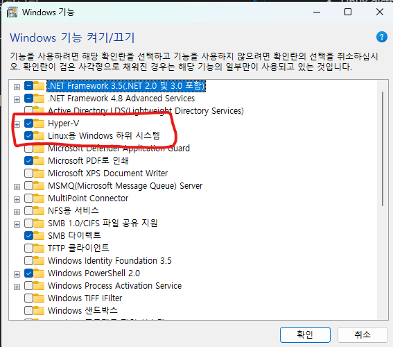
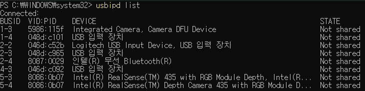
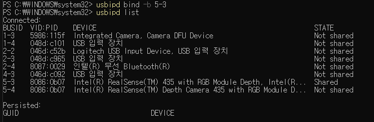
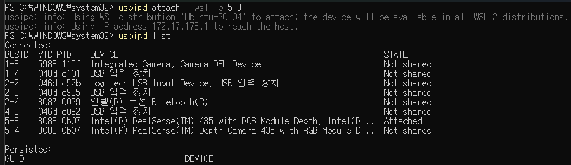
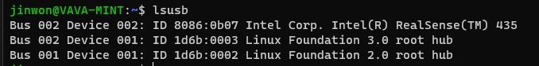

# WSL2-USB-Camera
All content has been referenced from [Microsoft Connect USB](https://learn.microsoft.com/ko-kr/windows/wsl/connect-usb).

# Tutorial Video
https://github.com/user-attachments/assets/91ec81fe-9d36-419f-bb28-0ead81061b8a

## Install WSL2
Before installing WSL2, check if CPU virtualization is enabled and if Hyper-V is supported.



Powershell 관리자 권한으로 입력
```bash
wsl --install
```

## Install USBIPD-WIN
In Window Powershell
```bash
winget install --interactive --exact dorssel.usbipd-win
```

In WSL2 terminal
```bash
sudo apt-get update
sudo apt-get -y install linux-tools-generic hwdata
sudo update-alternatives --install /usr/local/bin/usbip usbip /usr/lib/linux-tools/*-generic/usbip 20
```

In Window Powershell, Check device list
```bash
usbipd list
```


In Window Powershell, Binding device
```bash
usbipd bind -b <BUSID> # (e.g. usbipd bind -b 5-3)
```


In Window Powershell, Attach device
```bash
usbipd attach --wsl -b <BUSID> # (e.g. usbipd attach --wsl -b 5-3)
```


In WSL2 terminal, Check device
```bash
lsusb
```


## Update WSL2 Kernel
To use the camera in WSL2, you need to update the Linux kernel

You need to have the packages required for kernel update installed. If they are already installed, you can proceed.

In WSL2 terminal
```bash
sudo apt-get update
sudo apt-get -y upgrade

# Install required packages
sudo apt-get -y install build-essential flex bison libssl-dev libelf-dev libncurses-dev autoconf libudev-dev libtool dwarves bc wslu hwdata
```

In WSL2 terminal, clone a repository of WSL2-Linux-Kernel
```bash
WSL_VERSION=$(uname -r | cut -d '-' -f1)
git clone --depth 1 -b linux-msft-wsl-${WSL_VERSION} https://github.com/microsoft/WSL2-Linux-Kernel.git
cd WSL2-Linux-Kernerl
```
Copy config.gz
```bash
sudo cp /proc/config.gz config.gz
sudo gunzip config.gz
sudo mv config .config
```

Modifiy config
```bash
sudo scripts/config --enable CONFIG_MEDIA_SUPPORT
sudo scripts/config --enable CONFIG_MEDIA_SUPPORT_FILTER
sudo scripts/config --enable CONFIG_MEDIA_SUBDRV_AUTOSELECT
sudo scripts/config --enable CONFIG_MEDIA_CAMERA_SUPPORT
sudo scripts/config --enable CONFIG_VIDEO_V4L2_SUBDEV_API
sudo scripts/config --enable CONFIG_MEDIA_USB_SUPPORT
sudo scripts/config --enable CONFIG_USB_VIDEO_CLASS
sudo scripts/config --enable CONFIG_USB_VIDEO_CLASS_INPUT_EVDEV
sudo scripts/config --enable CONFIG_USB_GSPCA

sudo make olddefconfig
```

build
```bash
sudo make modules -j$(nproc)
sudo make modules_install
sudo make -j$(nproc)
sudo make install
```
Copy bzImage to Host PC(windows)

```bash
HOST_USERNAME=$(wslpath "$(wslvar USERPROFILE)" | cut -d '/' -f5) 
sudo cp arch/x86/boot/bzImage /mnt/c/Users/${HOST_USERNAME}/usbip-bzImage
```

Set C:/Users/${HOST_USERNAME}/.wslconfig
```bash
[wsl2]
kernel=path_to_image # example kernel=C:\\Users\\{HOSTNAME}\\usbip-bzImage
```

Restart wsl
```bash
wsl --shutdown

or

wsl --terminate <Distro>
```


